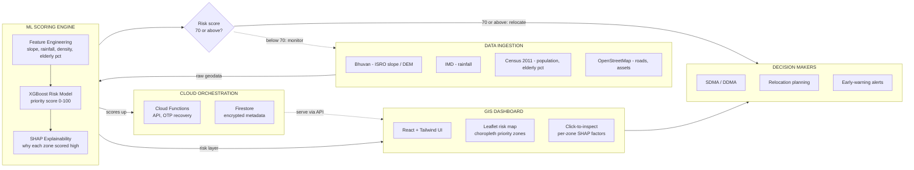
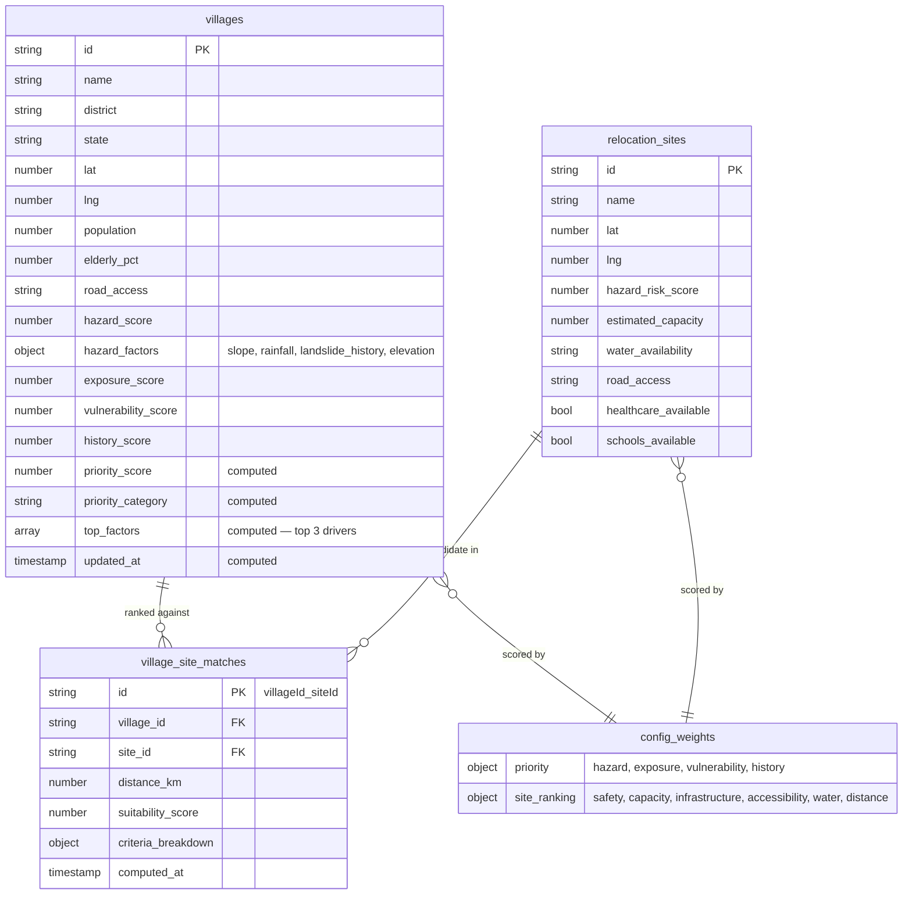
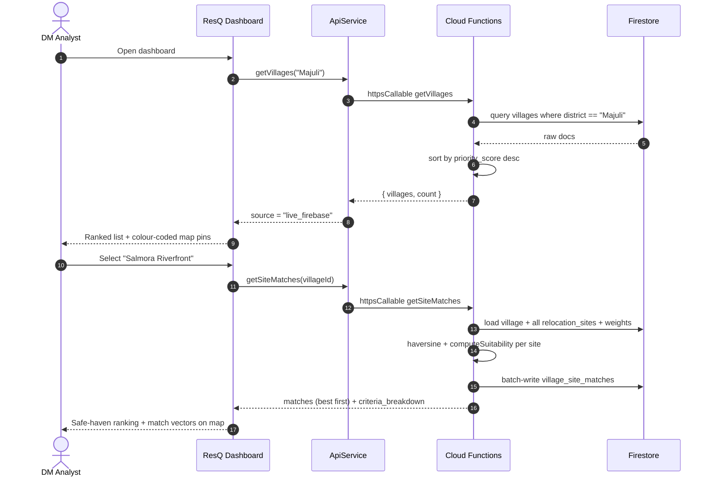
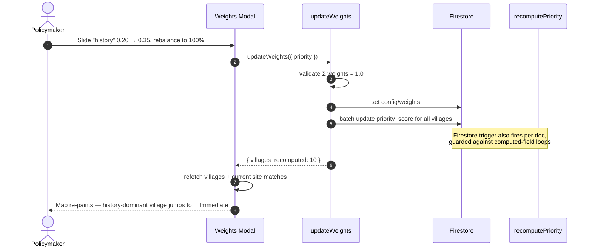
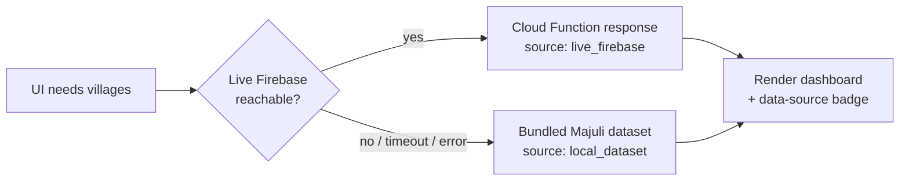

<div align="center">

# 🛰️ ResQ

### Geospatial Command & Algorithmic Resettlement Decision-Support Engine

**Which villages do we relocate first — and where do we move them?**
ResQ turns that question into a transparent, tunable, map-first answer for disaster-management authorities.

<br/>


-3ddc84)


<br/>

*Smart India Hackathon 2026 · Disaster Management & Climate Resilience*

</div>

---

## 📖 Table of Contents

1. [The Problem](#-the-problem)
2. [How ResQ Solves It](#-how-resq-solves-it)
3. [Key Features](#-key-features)
4. [Live Demo & Screens](#-live-demo--screens)
5. [Architecture](#-architecture)
6. [Tech Stack](#-tech-stack)
7. [How the Scoring Works](#-how-the-scoring-works)
8. [Data Model](#-data-model)
9. [API Reference](#-api-reference)
10. [End-to-End Workflows](#-end-to-end-workflows)
11. [Getting Started](#-getting-started)
12. [Project Structure](#-project-structure)
13. [Feasibility & Viability](#-feasibility--viability)
14. [Impact](#-impact)
15. [Roadmap](#-roadmap)

---

## 🌊 The Problem

Across India, thousands of villages sit directly in the path of **recurring, escalating natural hazards** — Himalayan landslides, Brahmaputra riverbank erosion, glacial-lake floods, coastal surge. When climate pressure makes a settlement genuinely unlivable, the state must do two hard things:

| Decision | Why it is hard today |
| :-- | :-- |
| **1. Prioritise** — which village is relocated first? | Risk data is scattered across PDFs, survey registers, and department silos. Ranking is done in meetings, on gut feel, and is impossible to defend when funds are limited. |
| **2. Place** — where does that village move to? | Candidate resettlement land is assessed ad-hoc. Safety, carrying capacity, water, road access, schools, hospitals and distance-from-home are rarely scored together. |
| **3. Justify** — why this village, why this site? | Auditors, courts, panchayats and the press all ask "why them and not us?". A spreadsheet with no visible logic invites challenge and stalls the project. |

> The cost of getting this wrong is measured in lives, in wasted relocation budgets, and in families moved to a site that floods again five years later.

---

## ✅ How ResQ Solves It

ResQ is a **single decision-support dashboard** that ingests village-level hazard indicators and candidate relocation sites, then produces a **ranked, colour-coded, fully explainable** action list on an interactive GIS map.

```
   Hazard indicators          ┌─────────────────┐          Ranked priority list
   (slope, rainfall,   ─────▶ │   ResQ Priority │ ─────▶   Immediate ▸ Short ▸
   erosion history,           │     Engine      │          Medium ▸ Monitor
   population, elderly %)     └─────────────────┘          + top-3 "why" factors

   Candidate sites            ┌─────────────────┐          Best-fit safe havens
   (safety, capacity,  ─────▶ │  ResQ Site      │ ─────▶   per village, with a
   water, roads,              │  Ranking Engine │          weighted score
   schools, hospitals)        └─────────────────┘          breakdown
```

**Three principles make it different from a spreadsheet:**

1. **Explainable by construction** — every score ships with its top contributing factors and a per-criterion weighted breakdown. Nothing is a black box.
2. **Policy is a slider, not a rewrite** — a policymaker changes *"how much should past disaster history matter vs. present physical hazard?"* in the UI, and **every village re-ranks in seconds**.
3. **Works when the network doesn't** — the dashboard runs against a live cloud backend, but transparently falls back to an on-device dataset so a field demo never dies on a bad connection.

---

## ⭐ Key Features

- 🗺️ **Interactive GIS map** (Leaflet) — villages as risk-graded pins, relocation sites as safe-haven markers, match vectors drawn from the selected village to its candidate sites.
- 📊 **Priority matrix** — all villages ranked by a weighted multi-factor score, filterable by district and priority category.
- 🧠 **Risk & AI diagnostics panel** — per-village hazard decomposition (slope / rainfall / erosion history / elevation) with the top-3 drivers surfaced.
- 🛡️ **Relocation safe-haven matching** — haversine distance + 6-criteria suitability score for every candidate site, best match first.
- 🎚️ **Live weight calibration** — adjust priority and site-ranking weights; backend batch-recomputes and the map re-paints. Weights are validated to sum to 100%.
- 🔎 **Explainability dossier** — a slide-over drawer with the full scoring story for briefings and audit trails.
- 📈 **Command overview stats** — critical red-zone count, population exposed, peak-threat epicentre, total vetted safe-haven capacity.
- 📴 **Offline-resilient mode** — automatic local fallback with a clear "data source" indicator.

---

## 🖼️ Live Demo & Screens

| | |
| :-- | :-- |
| **Frontend dev server** | `http://localhost:3000` |
| **Cloud Functions (Mumbai)** | `https://<function>-<hash>-el.a.run.app` / `asia-south1` |
| **Firebase project** | `sih2026-4b480` |
| **Demo scenario** | Majuli, Assam — 10 villages (incl. 2 contrast "hero" villages), 4 highland resettlement campuses |


---

## 🏗️ Architecture

> ResQ system architecture (Claude design deck, slide 3), rendered as a Mermaid graph so it stays live on GitHub. The original slide export can be dropped into `docs/architecture.png` if you prefer the artwork.



### Where the current prototype stands

The design above is the **target architecture**. The hackathon prototype in this repo implements the right-hand side end-to-end and stubs the ML block behind a stable schema:

| Block in the diagram | In this repo today |
| :-- | :-- |
| **Data Ingestion** | Curated seed dataset (`functions/seed/seedData.js`) for Majuli, Assam — sourced from the same public datasets the pipeline will automate. |
| **ML Scoring Engine** | Transparent **weighted-linear** scoring (`priorityEngine.js`, `siteRanking.js`) producing a 0–100 priority score + top-factor explainability. `hazard_score` / `hazard_factors` are the **schema boundary** an XGBoost + SHAP pipeline plugs into without touching the API or UI. |
| **Cloud Orchestration** | **Firebase Cloud Functions v2** (Node 20, `asia-south1`) — 4 callables (`getVillages`, `getVillageDetail`, `getSiteMatches`, `updateWeights`), a Firestore `recomputePriority` trigger, and `healthCheck` / `seedDatabase`; **Cloud Firestore** with public-read / server-only-write rules. |
| **GIS Dashboard** | **React 18 + Vite + Tailwind** SPA with a **Leaflet** risk map, priority matrix, diagnostics panel, explainability drawer, and a live weight-calibration modal — plus an offline-resilient local fallback. |
| **Decision Makers** | Command-overview stats, ranked action list, and a per-village dossier built for briefings and audit trails. |

### Why this shape

| Choice | Rationale |
| :-- | :-- |
| **Serverless (Cloud Functions + Firestore)** | Zero server ops for a hackathon team; scales to zero cost at idle; regional deploy in Mumbai keeps latency low for Indian users. |
| **Pure scoring engines, isolated from I/O** | `priorityEngine.js` / `siteRanking.js` take plain objects in and return plain objects out — trivially unit-testable and swappable for an ML model behind the same interface. |
| **Firestore trigger for recompute** | Editing a village's raw hazard data anywhere automatically refreshes its priority score — no manual "recalculate" step, with an infinite-loop guard on computed fields. |
| **Client-side resilient fallback** | The `ApiService` layer tries live Firebase first, then a bundled dataset, tagging every response with its `source` so the UI stays honest. |
| **Public-read / server-only-write rules** | Judges and demo users need no login; all mutations still flow through validated Cloud Functions. |

---

## 🧰 Tech Stack

### Frontend

| Layer | Technology |
| :-- | :-- |
| Framework | **React 18** (functional components + hooks) |
| Build tool | **Vite 6** |
| Styling | **Tailwind CSS 3** + PostCSS + custom glassmorphism theme |
| Maps / GIS | **Leaflet 1.9** + **react-leaflet 4** |
| Icons | **lucide-react** |
| Backend SDK | **Firebase Web SDK 11** (`firestore`, `functions/httpsCallable`) |
| Utilities | `clsx`, `tailwind-merge` |

### Backend

| Layer | Technology |
| :-- | :-- |
| Compute | **Firebase Cloud Functions v2** (Gen 2, Node.js 20), region `asia-south1` |
| Protocols | Callable (`onCall`), HTTP (`onRequest`), Firestore trigger (`onDocumentWritten`) |
| Database | **Cloud Firestore** (native mode) |
| Admin | **firebase-admin 13** |
| Local dev | **Firebase Emulator Suite** (Functions + Firestore + UI) |
| Security | `firestore.rules` — public read, writes exclusively via Admin SDK |

### Scoring / Logic

Pure JavaScript, no framework dependency — `computePriorityScore`, `computeTopFactors`, `computeSuitability`, plus a haversine distance helper.

---

## 🧮 How the Scoring Works

### 1. Village priority score

A weighted linear blend of four normalised (0–100) pillars:

```
priority_score = hazard_score        × w.hazard
               + exposure_score      × w.exposure
               + vulnerability_score × w.vulnerability
               + history_score       × w.history
```

Default weights (`config/weights.priority`, editable live):

| Pillar | Weight | Meaning |
| :-- | :-- | :-- |
| `hazard` | **0.35** | Present-day physical threat (slope, rainfall, erosion/landslide history, elevation) |
| `exposure` | **0.25** | People & assets in the hazard footprint |
| `vulnerability` | **0.20** | Coping capacity — elderly %, poverty, road access |
| `history` | **0.20** | Track record of past disaster damage |

Category thresholds (`priorityEngine.js`):

| Score | Category | Map colour |
| :-- | :-- | :-- |
| ≥ 71 | 🔴 **Immediate** | `#EF4444` |
| ≥ 51 | 🟠 **Short-term** | `#F97316` |
| ≥ 31 | 🟡 **Medium-term** | `#EAB308` |
| < 31 | 🟢 **Monitor** | `#10B981` |

```js
// functions/priorityEngine.js  (verbatim)
function computePriorityScore(village, weights) {
  const { hazard_score = 0, exposure_score = 0, vulnerability_score = 0, history_score = 0 } = village;
  const { hazard = 0, exposure = 0, vulnerability = 0, history: hist = 0 } = weights;

  const raw =
    hazard_score        * hazard +
    exposure_score      * exposure +
    vulnerability_score * vulnerability +
    history_score       * hist;

  const priority_score   = Math.round(raw * 100) / 100;
  const match            = CATEGORY_THRESHOLDS.find(({ min }) => priority_score >= min);
  const priority_category = match ? match.label : "Monitor";

  return { priority_score, priority_category };
}
```

**Explainability:** `computeTopFactors()` sorts the hazard sub-factors and returns the top 3, which the UI renders as *"Primary driver: landslide history (95)"*.

### 2. Relocation site suitability score

For each candidate site, six criteria are scored 0–100 and blended by `config/weights.site_ranking`:

| Criterion | How it's derived | Default weight |
| :-- | :-- | :-- |
| `safety` | `100 − site.hazard_risk_score` | **0.35–0.40** |
| `capacity` | Site capacity vs. village population (100 at ≥2×, 0 at ≤1×) | 0.20 |
| `infrastructure` | Mean of water / healthcare / schools availability | 0.15 |
| `accessibility` | Road-access tier (`good` 100 / `moderate` 60 / `poor` 25) | 0.10 |
| `water` | Water-availability tier (`high` 100 → `low` 25) | 0.10 |
| `distance` | `max(0, 100 − distance_km × 5)` — closer to home is better | 0.05–0.10 |

Distance is a straight-line **haversine** between village and site centroids:

```js
// functions/index.js
function haversineKm(lat1, lng1, lat2, lng2) {
  const R = 6371;
  const dLat = ((lat2 - lat1) * Math.PI) / 180;
  const dLng = ((lng2 - lng1) * Math.PI) / 180;
  const a =
    Math.sin(dLat / 2) ** 2 +
    Math.cos((lat1 * Math.PI) / 180) * Math.cos((lat2 * Math.PI) / 180) *
    Math.sin(dLng / 2) ** 2;
  return R * 2 * Math.atan2(Math.sqrt(a), Math.sqrt(1 - a));
}
```

Every match is returned with a `criteria_breakdown` object (`score`, `weight`, `weighted` per criterion) so the dashboard can render a stacked bar of *why this site won*.

---

## 🗂️ Data Model



---

## 🔌 API Reference

All business endpoints are **Firebase Callable Functions** (`httpsCallable`) in `asia-south1`. CORS and payload serialization are automatic.

### `getVillages(district?, priority_category?)`

Returns all villages sorted by `priority_score` descending.

```js
import { httpsCallable } from "firebase/functions";
import { functions } from "./firebase";

const getVillages = httpsCallable(functions, "getVillages");
const { data } = await getVillages({ district: "Majuli" });     // filters optional
// → { villages: [ { id, name, priority_score, priority_category, top_factors, ... } ], count: 10 }
```

### `getVillageDetail(villageId)`

Full village document; if `recommended_site_id` is set, the site doc is merged in as `recommended_site`.

```js
const getVillageDetail = httpsCallable(functions, "getVillageDetail");
const { data } = await getVillageDetail({ villageId: "mock-village-majuli-01" });
// → { village: { ...full doc, top_factors, recommended_site? } }
```

### `getSiteMatches(villageId)`

Ranks **every** relocation site against the village (distance + suitability), returns best-first, and **persists** the ranking to `village_site_matches` as a side effect.

```js
const getSiteMatches = httpsCallable(functions, "getSiteMatches");
const { data } = await getSiteMatches({ villageId: "mock-village-majuli-01" });
// → { village_id, matches: [ { site_id, site_name, distance_km, suitability_score, criteria_breakdown } ] }
```

### `updateWeights({ priority?, site_ranking? })`

Overwrites `config/weights` (each group validated to sum to `1.0 ± 0.01`), then **batch-recomputes priority for every village**.

```js
const updateWeights = httpsCallable(functions, "updateWeights");
const { data } = await updateWeights({
  priority: { hazard: 0.40, exposure: 0.25, vulnerability: 0.20, history: 0.15 }
});
// → { message: "...", new_weights: {...}, villages_recomputed: 10 }
```

### HTTP utilities (`onRequest`)

| Endpoint | Method | Purpose |
| :-- | :-- | :-- |
| `healthCheck` | `GET` | Liveness probe → `{ status: "ok", region, timestamp }` |
| `seedDatabase` | `POST` | Seed Firestore — **guarded**: only runs when `ENVIRONMENT` is `demo`/`dev`, optional `Bearer` token |

---

## 🔄 End-to-End Workflows

### Workflow A — Analyst reviews the priority list



### Workflow B — Policymaker re-tunes the model



### Workflow C — Resilient fallback



---

## 🚀 Getting Started

### Prerequisites

| Tool | Version |
| :-- | :-- |
| Node.js | 20.x+ |
| npm | 10.x+ |
| Java JDK | 11+ (Firestore emulator) |
| Firebase CLI | `npm i -g firebase-tools` |

### 1. Clone & install

```bash
git clone https://github.com/acakefromdafuture3/SIH2026.git
cd SIH2026

# Frontend deps (root)
npm install

# Backend deps
cd functions && npm install && cd ..
```

### 2. Configure environment

```bash
cp .env.example .env
# fill in VITE_FIREBASE_* values from your Firebase project settings
```

### 3. Run the backend (emulators)

```bash
npm run emulators:start
```

| Service | URL |
| :-- | :-- |
| Emulator UI | http://127.0.0.1:4000 |
| Functions | http://127.0.0.1:5001/sih2026-4b480/asia-south1 |
| Firestore | 127.0.0.1:8080 |

### 4. Seed demo data (Majuli, Assam)

```bash
npm run seed          # against local emulator
# or:  npm --prefix functions run seed:live   # against live project
```

### 5. Run the frontend

```bash
npm run dev           # → http://localhost:3000
```

The dashboard connects to live Firebase by default and falls back to the bundled dataset automatically if the backend is unreachable.

### 6. Quick smoke test

```bash
curl http://127.0.0.1:5001/sih2026-4b480/asia-south1/healthCheck

curl -X POST http://127.0.0.1:5001/sih2026-4b480/asia-south1/getVillages \
  -H "Content-Type: application/json" -d '{"data": {}}'
```

### Deploy

```bash
npx firebase deploy --only functions,firestore:rules
npm --prefix functions run seed:live
npm --prefix functions run test:live   # end-to-end live smoke test
```

---

## 📁 Project Structure

```text
SIH2026/
├── index.html                  # Vite entry (ResQ shell, Leaflet + Inter font)
├── vite.config.js              # Dev server on :3000
├── tailwind.config.js
├── package.json                # Frontend scripts (dev / build / preview / emulators / seed)
├── firebase.json               # Emulator + functions + firestore config
├── firestore.rules             # Public read · server-only write
├── .env.example                # VITE_FIREBASE_* template
│
├── src/                        # ── FRONTEND (React + Vite) ──
│   ├── main.jsx
│   ├── App.jsx                 # Command-center layout, tabs, state orchestration
│   ├── firebase.js             # SDK init + httpsCallable wrappers
│   ├── services/api.js         # ApiService — live-first, resilient local fallback
│   ├── data/mockChamoliData.js # Bundled offline dataset (Majuli / Chamoli)
│   ├── constants/theme.js
│   └── components/
│       ├── Navbar.jsx
│       ├── StatsOverview.jsx   # Red zones · pop. exposed · epicentre · haven capacity
│       ├── VillageList.jsx     # Priority matrix (filter by category)
│       ├── MapView.jsx         # Leaflet GIS map
│       ├── MapPins.jsx         # Risk-graded village + site markers
│       ├── VillageDetail.jsx   # Risk & AI diagnostics
│       ├── VillageDrawer.jsx   # Slide-over explainability dossier
│       ├── SiteMatchList.jsx   # Ranked safe havens
│       └── WeightsModal.jsx    # Live weight calibration
│
└── functions/                  # ── BACKEND (Firebase Cloud Functions) ──
    ├── index.js                # 4 callables + 1 trigger + 2 HTTP utils, input validation
    ├── priorityEngine.js       # Pure: computePriorityScore, computeTopFactors
    ├── siteRanking.js          # Pure: computeSuitability, capacity/infra helpers
    └── seed/
        ├── seedData.js         # Majuli dataset + 2 "hero" contrast villages
        ├── testScoring.js      # Unit tests — scoring engines
        ├── testFunctions.js    # Integration tests — callables
        └── smokeTest.js        # Live end-to-end test
```

---

## 📐 Feasibility & Viability

### Technical feasibility ✅

| Factor | Assessment |
| :-- | :-- |
| **Build complexity** | Low. Working prototype already runs end-to-end on managed infra with zero custom servers. |
| **Scoring model** | Transparent weighted linear models — explainable, fast, no training data required to start. Pure functions are already unit-tested. |
| **Data availability** | Inputs (slope, rainfall, historical damage, census population, elderly %, road access) exist in NRSC/Bhuvan, IMD, Census of India, and state DM department records. |
| **Scale** | Firestore + Cloud Functions scale horizontally; a district has ~10²–10³ villages — comfortably within a single query + in-process sort. |
| **ML upgrade path** | `hazard_score` / `hazard_factors` are already a stable schema boundary — a remote-sensing/ML pipeline can replace the values without touching the API or UI. |

### Operational & economic viability ✅

| Factor | Assessment |
| :-- | :-- |
| **Cost** | Serverless scales to near-zero at idle. A state-level deployment fits comfortably in Firebase's low-cost tier; no procurement of servers or GIS licenses (Leaflet + OSM are free). |
| **Adoption** | Runs in any browser, no install, no login for viewers. Fits existing DM-department workflows as a decision aid, not a process replacement. |
| **Maintenance** | Single codebase, managed runtime, no OS patching. Weight tuning is a UI action, not a redeploy. |
| **Governance fit** | Aligns with NDMA relocation guidelines and state climate-adaptation plans; the audit trail supports RTI / CAG scrutiny. |

### Risks & mitigations

| Risk | Mitigation |
| :-- | :-- |
| Garbage-in data quality | Explainable scores make bad inputs visible; per-factor breakdown flags outliers. |
| "Why was our village ranked low?" disputes | Every score is defensible with visible weights + top factors + a shareable dossier. |
| Demo/hackathon security posture (open reads) | Documented in `firestore.rules`; production path is Firebase Auth + RBAC before any real data. |
| Connectivity in the field | Built-in offline dataset fallback with an explicit source indicator. |

---

## 🌍 Impact

| Dimension | Impact |
| :-- | :-- |
| 🎯 **Better decisions** | Replaces meeting-room intuition with a consistent, multi-factor ranking — the same rules applied to every village. |
| ⏱️ **Faster planning** | Re-prioritising an entire district after a policy change takes seconds, not weeks of manual spreadsheet work. |
| 💰 **Budget efficiency** | Directs scarce relocation funds to the highest-risk populations first, and to sites that won't need re-relocation. |
| 🧑‍⚖️ **Accountability** | A visible, exportable rationale for every choice — defensible to auditors, courts, panchayats and press. |
| 🤝 **Community trust** | Villagers can see *why* a decision was made, reducing the friction and litigation that stall resettlement projects. |
| 🌡️ **Climate adaptation** | A reusable framework for proactive managed retreat as hazard patterns shift — floods, erosion, landslides, coastal surge. |
| ♻️ **Reusability** | District-agnostic: switch the seed dataset from Majuli (erosion/flood) to Chamoli (landslide) with no code change. |

**Illustrative demo outcome (Majuli seed):** ResQ instantly surfaces *Salmora Riverfront* (priority ≈ 92, driven by riverbank erosion history and low elevation) as the #1 relocation candidate and ranks the *Jengraimukh Safe Highland Campus* as its best-fit haven — with the full score breakdown one click away.

---

## 🛣️ Roadmap

- [ ] **Real hazard pipeline** — ingest Bhuvan/Sentinel slope, rainfall and erosion-change rasters into `hazard_factors`.
- [ ] **Authentication & RBAC** — Firebase Auth roles: `viewer`, `analyst`, `policymaker`.
- [ ] **Scenario save/compare** — snapshot a weight configuration and diff two policies side by side.
- [ ] **Report export** — one-click PDF dossier per village for field officers.
- [ ] **Multi-district & state rollup** — aggregate priority views above the district level.
- [ ] **Capacity-aware allocation** — solve village→site assignment as an optimisation, not just per-village ranking.
- [ ] **Offline PWA** — installable, with background sync when connectivity returns.

---

<div align="center">

**ResQ** — Disaster Management & Algorithmic Resettlement Decision Support Engine
Built for Smart India Hackathon 2026

<sub>MIT Licensed · Frontend + Backend in one repo · Runs on Firebase (asia-south1)</sub>

</div>
